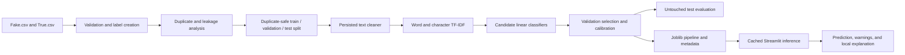

# Fake News Detection with TF-IDF and Scikit-learn

A reproducible, leakage-aware NLP system that classifies English news text as **Fake News** (`0`) or **Real News** (`1`). It compares multiple sparse linear classifiers, evaluates probability calibration, explains predictions with TF-IDF feature contributions, and serves the selected pipeline through Streamlit.

> This is a language-pattern classifier, not a fact-checking engine. It does not browse sources, inspect evidence, or determine objective truth.

## What this project demonstrates

- Safe ingestion of separate `Fake.csv` and `True.csv` source files
- Missing-value, duplicate, contradictory-label, and low-information checks
- Explicit source-marker and class-artifact leakage investigation
- Baseline, duplicate-safe, and optional time-aware splitting
- One persisted preprocessing → TF-IDF → classifier pipeline
- Dummy, Multinomial Naive Bayes, Logistic Regression, Passive Aggressive, and Linear SVM comparisons
- Stratified cross-validation and untouched test-set evaluation
- Native, sigmoid, and isotonic probability-calibration comparison
- Accuracy, precision, recall, F1, macro/weighted F1, ROC-AUC, PR-AUC, log loss, Brier score, ECE, latency, and model-size tracking
- Global coefficients and local `TF-IDF × coefficient` explanations
- Streamlit pages for prediction, performance, explainability, EDA, error analysis, architecture, and ethics
- Synthetic unit tests that do not require the production dataset

## Business problem

Misinformation screening is difficult because writing style, source conventions, and political topics can correlate with a dataset label without proving a claim false. This system therefore provides a cautious screening signal with input-quality warnings and interpretable language features. It is suitable for learning, portfolio demonstrations, and human-in-the-loop analysis—not automated moderation.

## System architecture



Raw data is read but never overwritten. The processed table, split assignments, reports, figures, model, metrics, and metadata are generated artifacts.

## Machine-learning methodology

### Preprocessing

The scikit-learn-compatible `CleanTextTransformer` is stored inside every model pipeline. It:

- applies Unicode NFKC normalization and lowercase conversion;
- removes HTML and email addresses;
- replaces URLs with `urltoken`;
- expands common contractions and preserves negation;
- limits excessive repeated characters;
- optionally normalizes numbers;
- removes known agency/copyright boilerplate;
- normalizes punctuation and whitespace without stemming or aggressive lemmatization.

Stopwords are applied only to word TF-IDF and explicitly retain `not`, `no`, `never`, `neither`, and `nor`. Character TF-IDF remains available for spelling and morphology patterns. All behavior is configured in [`config/config.yaml`](config/config.yaml).

### Features

The default union contains:

- word unigrams and bigrams;
- character 3–5-grams;
- sublinear term frequency and L2 normalization;
- configurable document-frequency thresholds and feature limits.

The vectorizers are fitted only on training folds. Inference never calls `fit`.

### Model selection

The training workflow first compares:

1. Dummy Classifier
2. Multinomial Naive Bayes
3. Logistic Regression
4. Passive Aggressive Classifier
5. Linear Support Vector Machine

The highest validation macro F1 selects the model family. Sigmoid and, where sample size permits, isotonic calibration are then compared. A calibrated native-probability model is deployed only when its validation Brier score improves without a material macro-F1 loss. A classifier without native probabilities is calibrated before deployment so the interface never converts raw margins into fake percentages.

The test split remains untouched until selection is complete. Results are measured by the code and are never hard-coded.

## Anti-leakage strategy

The ISOT-derived dataset contains strong opportunities for shortcut learning. This repository:

- never includes raw-file origin, `subject`, or `date` as model features;
- detects URLs, agency markers, copyright strings, dates, and class-specific n-grams;
- removes known Reuters/Associated Press signature patterns inside the persisted cleaner;
- removes exact and normalized duplicate content before splitting;
- rejects identical normalized articles with contradictory labels;
- groups matching normalized headlines during the default split;
- reports exact-hash overlap across splits;
- benchmarks Logistic Regression before and after source-marker removal;
- writes suspicious features and mitigation decisions to `reports/leakage_report.json`.

High accuracy should be treated skeptically when the before/after leakage benchmark changes materially or suspicious publisher features dominate.

## Dataset

Use the Kaggle [Fake and Real News Dataset](https://www.kaggle.com/datasets/clmentbisaillon/fake-and-real-news-dataset). Kaggle currently describes separate `Fake.csv` and `True.csv` files with `title`, `text`, `subject`, and `date` columns. The dataset is listed under **CC BY-NC-SA 4.0**; review that license before redistribution or commercial use. The CSVs are intentionally excluded from Git.

Download and extract the files so the layout is:

```text
data/
└── raw/
    ├── Fake.csv
    └── True.csv
```

Optional Kaggle CLI:

```bash
pip install kaggle
kaggle datasets download -d clmentbisaillon/fake-and-real-news-dataset -p data/raw --unzip
```

Never commit the raw CSVs. The code license in this repository does not relicense the dataset.

## Installation

Python 3.11 or later is required.

```bash
python -m venv .venv
```

Windows:

```bash
.venv\Scripts\activate
```

macOS or Linux:

```bash
source .venv/bin/activate
```

Install runtime dependencies:

```bash
pip install -r requirements.txt
```

For tests and linting:

```bash
pip install -r requirements-dev.txt
```

## Train, evaluate, and run

Train all candidates and generate artifacts:

```bash
python train.py
```

Re-evaluate the persisted pipeline on the saved untouched test split:

```bash
python evaluate.py
```

Classify one text from the command line:

```bash
python predict.py "The council released its audited budget report on Tuesday."
```

Run unit tests:

```bash
pytest
```

Run the application:

```bash
streamlit run app.py
```

Open the local URL shown by Streamlit. Confirm that all seven tabs load, empty input is rejected, short/non-English input warns, a prediction includes an estimated model probability, and influential terms appear. The app must start without training and show a helpful missing-model message when artifacts are absent.

## Measured results

No metrics are claimed before training. After `python train.py`, the definitive model comparison is written to `reports/model_comparison.csv`, and validation/test details are saved to `models/metrics.json`.

| Model | Validation macro F1 | CV mean ± std | Calibration | Test macro F1 |
|---|---:|---:|---|---:|
| Generated during training | See `reports/model_comparison.csv` | Measured | Selected on validation | Evaluated once |

For a résumé or portfolio, replace any provisional “92–96% accuracy” statement with the exact measured test result and split strategy from the generated metadata. A defensible example is:

> Built a leakage-aware TF-IDF fake-news classifier comparing five scikit-learn models on the ISOT dataset; achieved **[measured test metric]** under a duplicate-safe split and deployed calibrated, explainable inference with Streamlit.

## Explainability

For direct linear pipelines, global features are ranked by coefficient. For each prediction, non-zero word TF-IDF values are multiplied by coefficients, aggregated when calibration uses an ensemble, and separated into evidence toward each class. Character fragments remain active but are hidden from user-facing lists.

Highlighted terms are statistical signals learned from the training dataset. They do not independently prove that an article is true or false.

## Error analysis and robustness

`reports/error_analysis.csv` contains false positives and false negatives with headline, true/predicted label, calibrated confidence where available, influential features, word count, and a review hint. Prioritize high-confidence errors and inspect:

- very short text and headlines;
- satire, opinion, and mixed factual/misleading content;
- quotations and changing speaker voice;
- unseen publishers and breaking-news vocabulary;
- political or temporal drift;
- unusual, random, social-media, or mixed-language input.

The inference layer safely rejects empty and oversized text and warns about short, repetitive, likely non-English, and extremely low-coverage input. Robustness cases are included in unit tests without depending on production data.

## Generated artifacts

| Artifact | Purpose |
|---|---|
| `data/processed/news.csv` | Clean modeling table with fixed split assignments |
| `models/fake_news_pipeline.joblib` | Complete deployable pipeline |
| `models/model_metadata.json` | Version, fingerprint, configuration, dependencies, and metrics |
| `models/metrics.json` | Validation/test metrics and global explanations |
| `reports/model_comparison.csv` | Candidate, CV, timing, size, and calibration comparison |
| `reports/leakage_report.json` | Suspicious artifacts and before/after mitigation benchmark |
| `reports/eda_report.json` | Shape, missingness, lengths, class counts, and n-grams |
| `reports/error_analysis.csv` | Held-out misclassification review table |
| `reports/figures/*.png` | EDA, confusion matrix, ROC/PR, and reliability plots |

## Repository structure

```text
.
├── app.py
├── train.py
├── evaluate.py
├── predict.py
├── requirements.txt
├── requirements-dev.txt
├── pyproject.toml
├── README.md
├── LICENSE
├── config/
│   └── config.yaml
├── data/
│   ├── raw/
│   ├── interim/
│   └── processed/
├── models/
├── reports/
│   └── figures/
├── notebooks/
│   └── exploratory_analysis.ipynb
├── src/
│   └── fake_news_detector/
│       ├── calibration.py
│       ├── config.py
│       ├── data_loader.py
│       ├── data_validation.py
│       ├── eda.py
│       ├── error_analysis.py
│       ├── evaluation.py
│       ├── exceptions.py
│       ├── explainability.py
│       ├── feature_engineering.py
│       ├── inference.py
│       ├── leakage_detection.py
│       ├── logging_config.py
│       ├── model_factory.py
│       ├── preprocessing.py
│       ├── splitting.py
│       ├── training.py
│       └── utils.py
├── tests/
└── .github/
    └── workflows/
        └── tests.yml
```

## Streamlit Community Cloud deployment

1. Train locally with the exact dataset and configuration intended for deployment.
2. Confirm the compressed `models/fake_news_pipeline.joblib` is within GitHub and Streamlit limits. Use Git LFS if needed.
3. Commit the model, `models/model_metadata.json`, `models/metrics.json`, reports, source code, and root `requirements.txt`. Do **not** commit the raw dataset.
4. Push to GitHub.
5. In [Streamlit Community Cloud](https://share.streamlit.io/), choose the repository, branch, and `app.py`.
6. Select the same supported Python version used locally and deploy.
7. Smoke-test all tabs and a known input. Training is never triggered on startup.

Streamlit recommends placing `requirements.txt` at the repository root or beside the entry point; this project follows that layout. No secrets or paid APIs are required. Alternatives include Hugging Face Spaces, Render, Docker, and Google Cloud Run.

## Ethics and known limitations

- The model recognizes statistical patterns, not truth.
- It performs no retrieval or external fact-checking.
- Publisher and dataset bias can remain after mitigation.
- Language and current events drift over time.
- New events can be outside the training distribution.
- Satire and opinion may resemble misinformation.
- Confidence reflects model calibration on held-out dataset samples, not factual certainty.
- The system must not make censorship, legal, employment, or automated removal decisions.
- Human review and trusted primary/fact-checking sources remain necessary.

## Future improvements

- Compare preprocessing ablations, including lemmatization and stopword policies.
- Add more scalable near-duplicate clustering with MinHash/LSH.
- Evaluate source-held-out and rolling temporal splits on newer datasets.
- Add vocabulary/drift dashboards and batch CSV inference without server storage.
- Benchmark a transformer only after the leakage-aware TF-IDF baseline is stable.
- Track experiments with MLflow and data versions with DVC.
- Add retrieval from reputable fact-check databases as a separate evidence layer.

## Application screenshots

Add screenshots after local training and visual validation:

- Prediction with quality warning and explanation
- Model comparison and confusion matrix
- Reliability diagram
- Leakage report and suspicious-feature table

